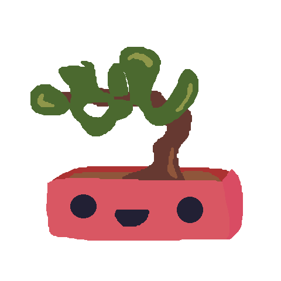
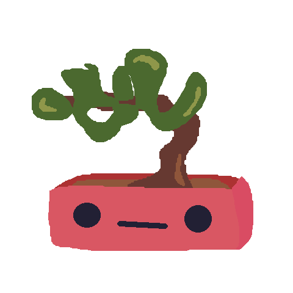
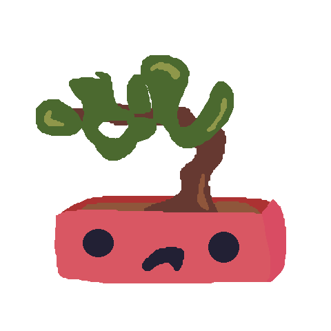
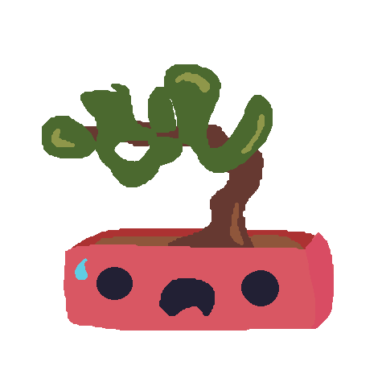

# 🌿 Gromie App 🌿

Welcome to the Gromie App! This application helps you monitor the moisture levels of your plants and provides visual feedback based on the moisture levels.

## Features

- 🌱 Add new plants and specify their size.
- 💧 Check the moisture level of each plant.
- 🌿 Visual feedback with images that change based on the moisture level.

## Current Usage

1. Click the "Add Plant" button to add a new plant.
2. Select the size of the plant.
3. Click the "Check Moisture Level" button to update the moisture level and see the visual feedback.

## Live Build: [CLICK HERE](https://gromie.vercel.app/)

## Showcase

Here are some of the images used in the app to represent different moisture levels:

**NOTE:** These sprites are very much placeholders, and are subject to change.

### Happy Plant (High Moisture)

### Meh Plant (Medium Moisture)

### Bad Plant (Low Moisture)

### Sad Plant (Very Low Moisture)

---

Happy growing! 🌿